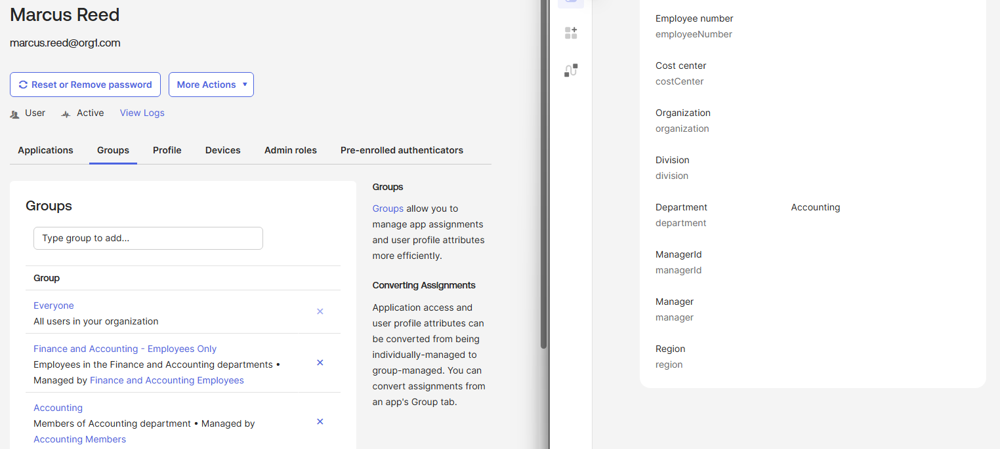
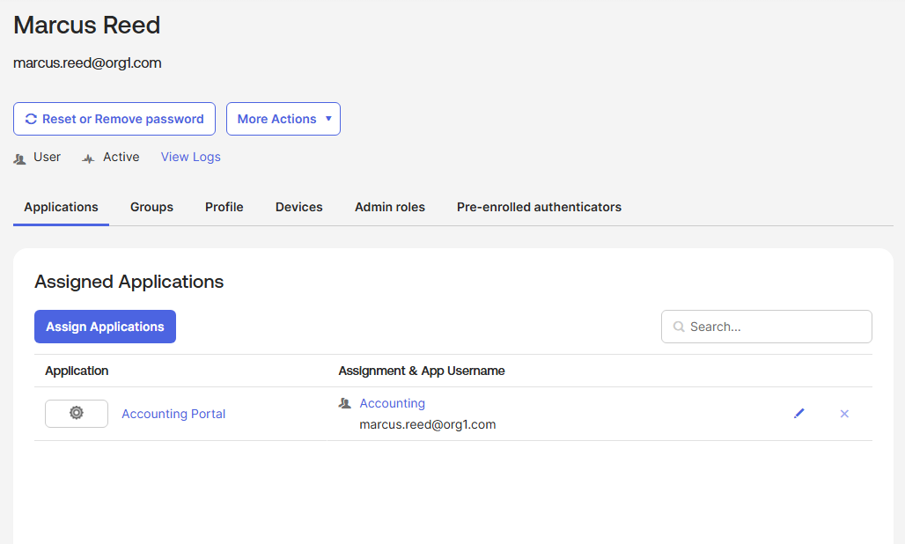
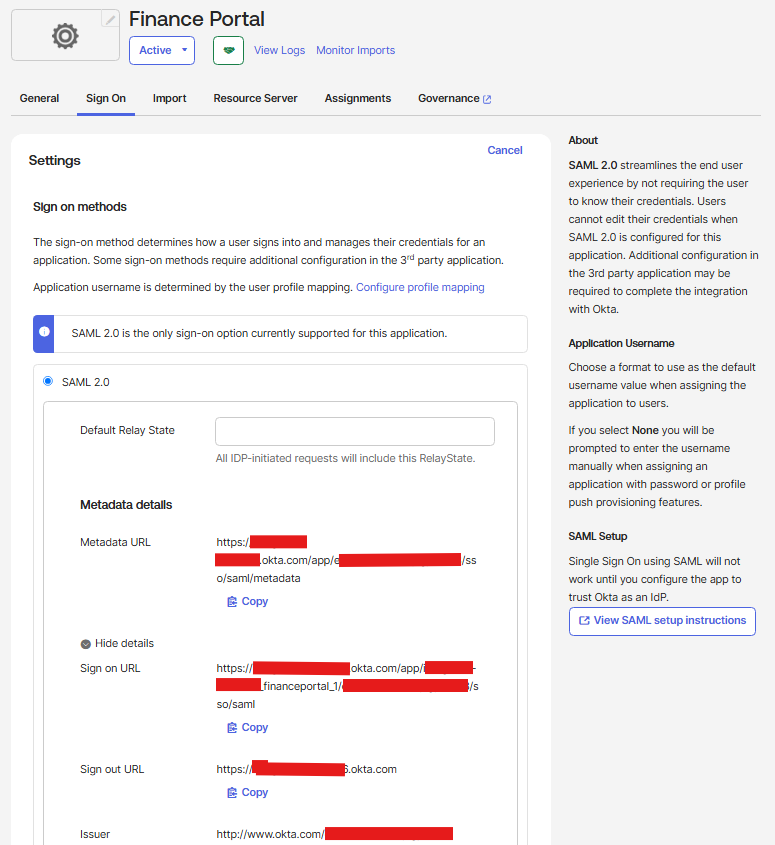
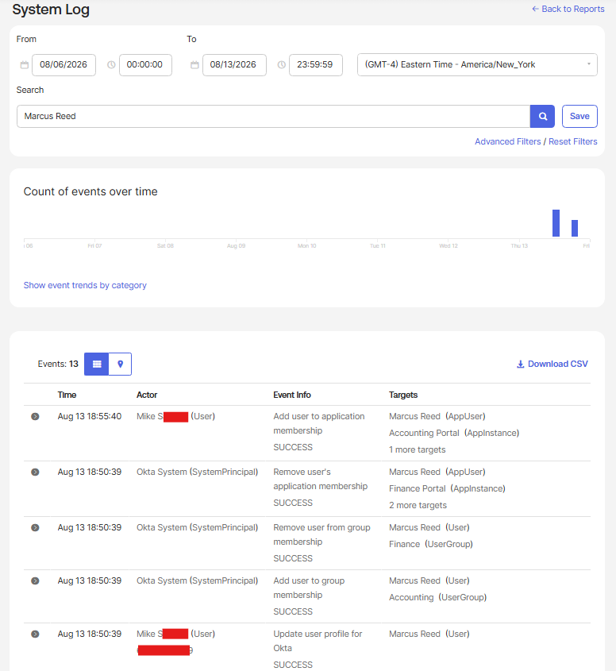
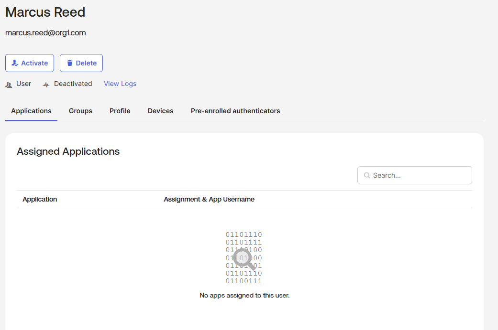

<h1>Okta Identity Lifecycle Management and SAML Application Access</h1>

In this lab, we used Okta to automate identity lifecycle and application access based on user attributes and group membership. We configured department-based Group Rules, group-assigned applications, and SAML 2.0 application integrations. We then simulated an employee department transfer and termination to observe how Okta automatically updates group membership, application access, and lifecycle status. System Log events were reviewed to verify and audit the automated changes.

 

<h2>Environments and Technologies Used</h2>

- Okta Identity Cloud
- Okta Universal Directory
- Okta Group Rules
- Okta Expression Language
- Lifecycle Management
- SAML 2.0
- Single Sign-On (SSO)
- Okta System Log

<h2>High-Level Steps</h2>

- Step 1. Configure Attribute-Based Group Membership
- Step 2. Configure Group-Based Application Access
- Step 3. Configure SAML 2.0 Application Integration
- Step 4. Simulate Employee Department Transfer
- Step 5. Review Automated Changes in System Log
- Step 6. Deactivate User and Verify Application Removal

> [!IMPORTANT]
> Application access in this lab is assigned through Okta groups rather than directly to individual users. This allows changes to user attributes to automatically affect downstream application access.

<h2>Actions and Observations</h2>

<b>1. ATTRIBUTE-BASED GROUP MEMBERSHIP</b>

A test user, Marcus Reed, was initially configured with the Finance department. The existing Finance Group Rule automatically evaluated the user's department attribute and assigned the Finance group without requiring manual group membership.

The user's Department was then changed from Finance to Accounting to simulate an employee transfer.

Okta automatically reevaluated the Group Rules, removed Marcus from Finance, and added him to Accounting.

See screenshot

> [!NOTE]
> The Accounting group displays **Managed by Accounting Members**, confirming that membership is controlled by an Okta Group Rule rather than a manual assignment.

 

<b>2. GROUP-BASED APPLICATION ACCESS</b>

The Finance Portal and Accounting Portal applications were assigned to their respective department groups rather than directly to Marcus.

After Marcus's department changed to Accounting, his Finance group membership was automatically removed. Because Finance Portal access was inherited through the Finance group, the Finance Portal entitlement was also removed.

His new Accounting group membership automatically provided access to the Accounting Portal.

See screenshot

> [!IMPORTANT]
> This demonstrates stale-access prevention. Changing the authoritative department attribute automatically changed both group membership and downstream application access without manually modifying the user's entitlements.

 

<b>3. SAML 2.0 APPLICATION INTEGRATION</b>

A custom SAML 2.0 application integration was created for the Finance Portal.

The integration was configured with SAML Service Provider information including the Single Sign-On URL, Audience URI, NameID format, and application username.

Okta acts as the Identity Provider (IdP), while the integrated application represents the Service Provider (SP).

See screenshot

> [!NOTE]
> Tenant-specific information in the screenshot was intentionally redacted before publication.

> [!IMPORTANT]
> The SAML configuration in this lab demonstrates the Okta-side application integration. The test Service Provider endpoint was not used to demonstrate a production end-to-end SSO session.

 

<b>4. EMPLOYEE MOVER WORKFLOW</b>

The department change from Finance to Accounting demonstrated the Mover stage of the Joiner-Mover-Leaver lifecycle.

The resulting workflow was:

`Department: Finance → Accounting`

`Finance Group → Removed`

`Finance Portal → Removed`

`Accounting Group → Added`

`Accounting Portal → Added`

No manual group or application changes were required after updating the user's department.

 

<b>5. SYSTEM LOG AND AUDIT VERIFICATION</b>

The Okta System Log was reviewed to verify the automated lifecycle events generated by the department change.

The log recorded:

- User profile updated
- User added to Accounting group
- User removed from Finance group
- Finance Portal application membership removed
- Accounting Portal application membership added

See screenshot

> [!NOTE]
> Automated entitlement changes identify **Okta System** as the actor. The System Log provides an audit trail that can be used to determine what changed, when the change occurred, and whether it resulted from administrator activity or Okta automation.

 

<b>6. USER DEACTIVATION AND ACCESS REMOVAL</b>

To simulate the Leaver stage of the identity lifecycle, Marcus Reed's Okta account was deactivated.

After deactivation, the user could no longer access Okta and the Accounting Portal application assignment was removed. The identity remained in Okta in a deactivated state, preserving the account for administrative and audit purposes.

See screenshot

> [!IMPORTANT]
> Deactivation was used instead of deleting the user. This disables access and removes application assignments while retaining the identity record for lifecycle and audit purposes.

 

<h2>Skills Demonstrated</h2>

- Okta Identity Administration
- Joiner-Mover-Leaver (JML)
- Identity Lifecycle Management
- Attribute-Based Access
- Okta Group Rules
- Group-Based Application Assignment
- Automated Provisioning and Deprovisioning
- SAML 2.0
- Identity Provider (IdP) and Service Provider (SP)
- Single Sign-On Configuration
- Stale Access Prevention
- Okta System Log
- IAM Auditing and Troubleshooting
